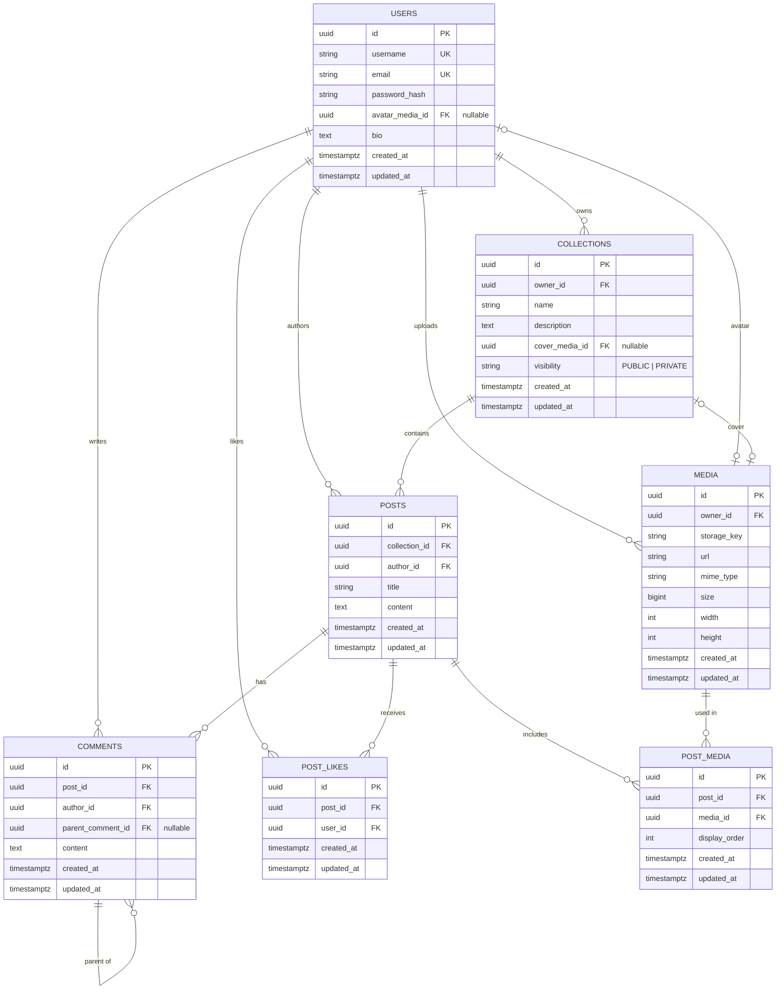

# DanNest — Database Schema

The schema for DanNest (social + collections). Source of truth for the fields is
`dannest-project-spec.md`; the tables are created by the Flyway migration
[`service/src/main/resources/db/migration/V1__init.sql`](../service/src/main/resources/db/migration/V1__init.sql)
and mapped by JPA entities under `service/src/main/java/com/dannest/`.

## Base entity

Every entity extends a single `@MappedSuperclass` **`BaseEntity`** — so all tables
share `id` (UUID), `created_at`, and `updated_at`. The timestamps are filled
automatically by Spring Data JPA auditing (`@CreatedDate` / `@LastModifiedDate`).

## ER diagram

## Tables

| Table | Purpose | Notes |
| --- | --- | --- |
| `users` | accounts | `username` + `email` unique; `avatar_media_id` → `media` (nullable) |
| `media` | generic asset | avatars, covers, post images (Cloudflare R2); `owner_id` → `users` |
| `collections` | themed groups | `owner_id` → `users`; `cover_media_id` → `media`; `visibility` PUBLIC/PRIVATE |
| `posts` | a post in a collection | `collection_id`, `author_id` |
| `post_media` | post ↔ image join | own `id`, ordered by `display_order`, unique `(post_id, media_id)` |
| `comments` | replies on a post | `parent_comment_id` (nullable) → nested threads |
| `post_likes` | a user's like | own `id`, unique `(post_id, user_id)` |

## Notes

- **Generic media** — avatars, covers, and post images are all `media` rows.
- **Circular FK** — `users.avatar_media_id ↔ media.owner_id`; `avatar_media_id` is
  nullable and set after the media row exists (the migration adds that FK last).
- **Deletes** — `post_media`, `comments`, `post_likes` cascade when their `post` is deleted.
- **Not yet** (spec *Future Features*): saves/bookmarks, follows, tags, search.
