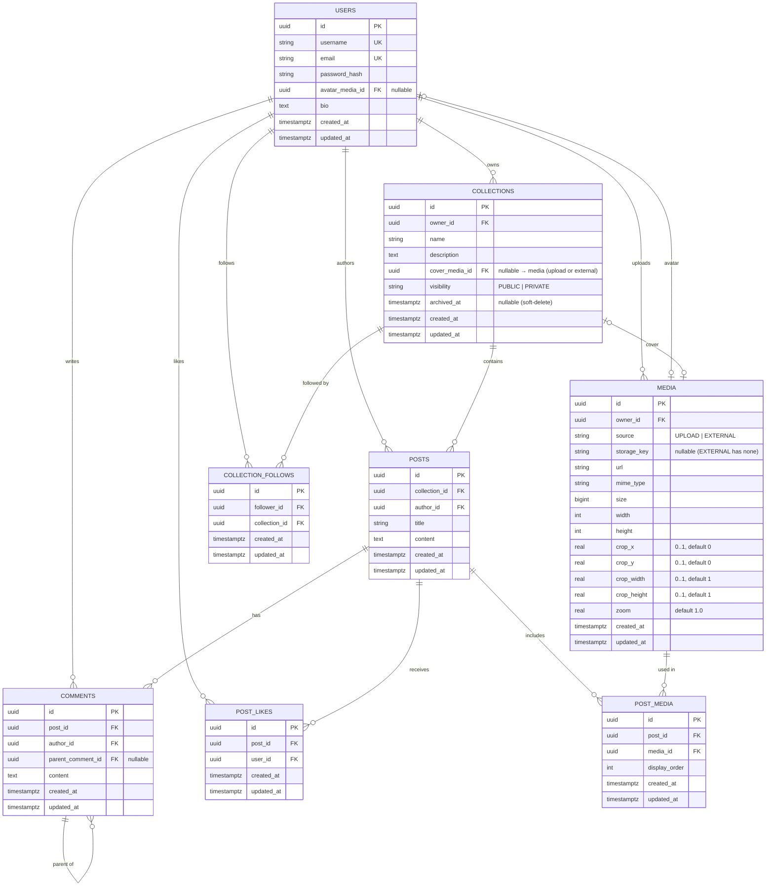

# DanNest — Database Schema

DanNest is split into two services, each with its **own** Postgres database —
see [Lesson 4](lesson-4-microservices.md). This doc covers **Core's**
database (social + collections); the notification service's much smaller
schema is at the bottom.

## Core's database

Source of truth for the fields is `dannest-project-spec.md`; the tables are
created by the Flyway migrations in
[`services/core/src/main/resources/db/migration/`](../services/core/src/main/resources/db/migration/)
and mapped by JPA entities under `services/core/src/main/java/com/dannest/`.

## Base entity

Every entity extends a single `@MappedSuperclass` **`BaseEntity`** — so all tables
share `id` (UUID), `created_at`, and `updated_at`. The timestamps are filled
automatically by Spring Data JPA auditing (`@CreatedDate` / `@LastModifiedDate`).

## ER diagram

```mermaid
erDiagram
    USERS ||--o{ COLLECTIONS : owns
    USERS ||--o{ POSTS : authors
    USERS ||--o{ MEDIA : uploads
    USERS ||--o{ COMMENTS : writes
    USERS ||--o{ POST_LIKES : likes
    USERS |o--o| MEDIA : "avatar"
    COLLECTIONS |o--o| MEDIA : "cover"
    COLLECTIONS ||--o{ POSTS : contains
    POSTS ||--o{ POST_MEDIA : includes
    MEDIA ||--o{ POST_MEDIA : "used in"
    POSTS ||--o{ COMMENTS : has
    COMMENTS ||--o{ COMMENTS : "parent of"
    POSTS ||--o{ POST_LIKES : receives
    USERS ||--o{ COLLECTION_FOLLOWS : follows
    COLLECTIONS ||--o{ COLLECTION_FOLLOWS : "followed by"

    USERS {
        uuid id PK
        string username UK
        string email UK
        string password_hash
        uuid avatar_media_id FK "nullable"
        text bio
        timestamptz created_at
        timestamptz updated_at
    }
    COLLECTIONS {
        uuid id PK
        uuid owner_id FK
        string name
        text description
        uuid cover_media_id FK "nullable → media (upload or external)"
        string visibility "PUBLIC | PRIVATE"
        timestamptz archived_at "nullable (soft-delete)"
        timestamptz created_at
        timestamptz updated_at
    }
    POSTS {
        uuid id PK
        uuid collection_id FK
        uuid author_id FK
        string title
        text content
        timestamptz created_at
        timestamptz updated_at
    }
    MEDIA {
        uuid id PK
        uuid owner_id FK
        string source "UPLOAD | EXTERNAL"
        string storage_key "nullable (EXTERNAL has none)"
        string url
        string mime_type
        bigint size
        int width
        int height
        real crop_x "0..1, default 0"
        real crop_y "0..1, default 0"
        real crop_width "0..1, default 1"
        real crop_height "0..1, default 1"
        real zoom "default 1.0"
        timestamptz created_at
        timestamptz updated_at
    }
    POST_MEDIA {
        uuid id PK
        uuid post_id FK
        uuid media_id FK
        int display_order
        timestamptz created_at
        timestamptz updated_at
    }
    COMMENTS {
        uuid id PK
        uuid post_id FK
        uuid author_id FK
        uuid parent_comment_id FK "nullable"
        text content
        timestamptz created_at
        timestamptz updated_at
    }
    POST_LIKES {
        uuid id PK
        uuid post_id FK
        uuid user_id FK
        timestamptz created_at
        timestamptz updated_at
    }
    COLLECTION_FOLLOWS {
        uuid id PK
        uuid follower_id FK
        uuid collection_id FK
        timestamptz created_at
        timestamptz updated_at
    }
```

## Tables

| Table | Purpose | Notes |
| --- | --- | --- |
| `users` | accounts | `username` + `email` unique; `avatar_media_id` → `media` (nullable) |
| `media` | generic image asset | avatars, covers, post images. `source` = UPLOAD (bytes in R2) or EXTERNAL (a link, no storage). Carries its own crop/zoom framing. `owner_id` → `users` |
| `collections` | themed groups | `owner_id` → `users`; `cover_media_id` → `media`; `visibility` PUBLIC/PRIVATE; `archived_at` (soft-delete) |
| `posts` | a post in a collection | `collection_id`, `author_id` |
| `post_media` | post ↔ image join | own `id`, ordered by `display_order`, unique `(post_id, media_id)` |
| `comments` | replies on a post | `parent_comment_id` (nullable) → nested threads |
| `post_likes` | a user's like | own `id`, unique `(post_id, user_id)` |
| `collection_follows` | a user following a collection (to be notified of new posts) | `follower_id` → `users`; `collection_id` → `collections`; unique `(follower_id, collection_id)` |

## Image crop / zoom (framing)

Framing lives **on the `media` row** (one crop per asset), so it's reused everywhere
the image is referenced — collection cover, user avatar, post image — with **no
duplicate columns** on those tables.

- `crop_x, crop_y, crop_width, crop_height` — the visible rectangle as fractions
  (0..1) of the original image. This alone is enough to render.
- `zoom` — optional; the rect already implies zoom, but this restores the cropper's
  exact state when re-editing.
- **Render**: apply via CSS now (`object-position` + scale); the same metadata maps
  directly to an image CDN (e.g. Cloudflare Images) later with no schema change.

Because framing is on `media`, an **external image is also a `media` row**
(`source = EXTERNAL`, `storage_key` null, `url` = the link). This unifies every
image reference behind `…_media_id` and lets links carry crop too. It supersedes the
transitional `collections.cover_url` (V4), which will be migrated to an EXTERNAL
`media` row + `cover_media_id`.

> Migration to implement this: `media` gains `source`, nullable `storage_key`, and the
> five crop columns; existing `collections.cover_url` values become EXTERNAL `media` rows.

## Notes

- **Generic media** — avatars, covers, and post images are all `media` rows.
- **Circular FK** — `users.avatar_media_id ↔ media.owner_id`; `avatar_media_id` is
  nullable and set after the media row exists (the migration adds that FK last).
- **Deletes** — `post_media`, `comments`, `post_likes` cascade when their `post` is deleted.
- **Not yet** (spec *Future Features*): saves/bookmarks, tags, search.

## Notification service's database

A separate, much smaller Postgres owned by `services/notification` —
[`services/notification/src/main/resources/db/migration/V1__init.sql`](../services/notification/src/main/resources/db/migration/V1__init.sql).
One table, **no foreign keys to Core's tables** (different database — Postgres
can't enforce a FK across a network boundary, and this service shouldn't be
querying Core's database anyway):

| Column | Type | Notes |
| --- | --- | --- |
| `id` | uuid PK | |
| `recipient_id`, `actor_id` | uuid | reference `users.id` in Core's DB — logical only, no FK |
| `actor_username`, `actor_avatar_url` | text | **denormalized** — copied from the event at write time, not looked up |
| `type` | varchar(20) | `NEW_POST` \| `COMMENT_REPLY` |
| `collection_id`, `collection_name` | uuid, text | `collection_name` denormalized, same reason as actor fields |
| `post_id`, `comment_id` | uuid | `comment_id` nullable |
| `read_at` | timestamptz, nullable | |
| `created_at`, `updated_at` | timestamptz | |

Filled entirely by consuming `DannestEvent` messages off RabbitMQ (see
[Lesson 4](lesson-4-microservices.md)) — this service never queries Core's
database to render a notification, which is *why* the denormalized columns
exist instead of just storing IDs.
