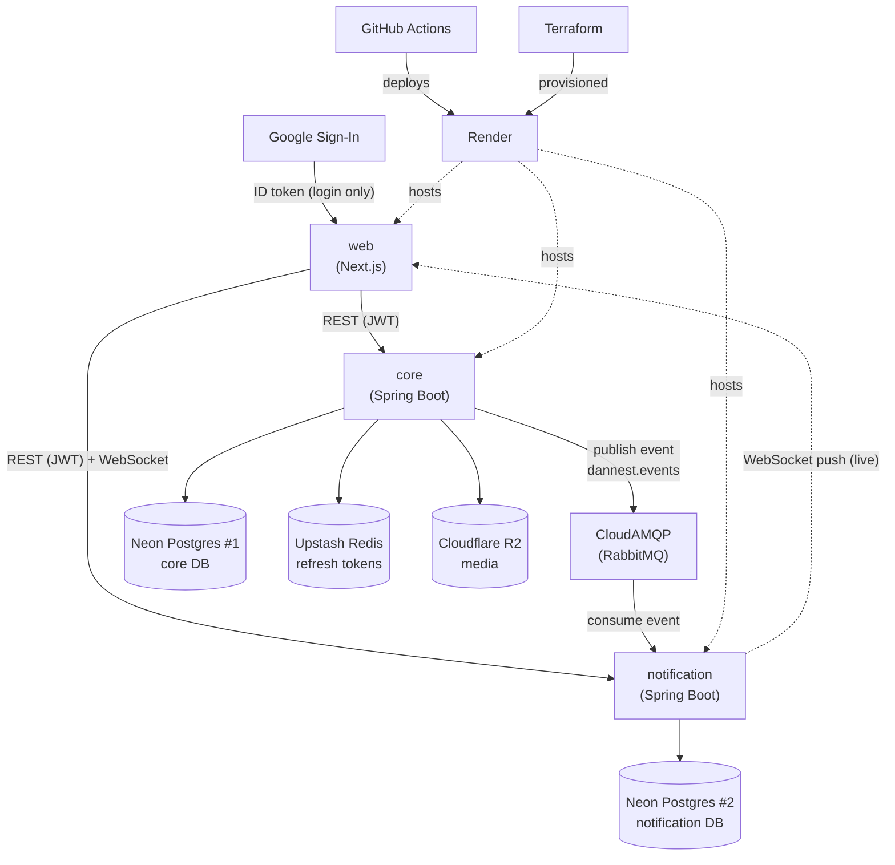
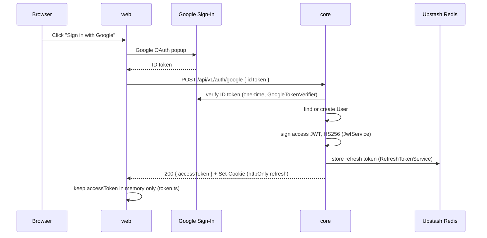
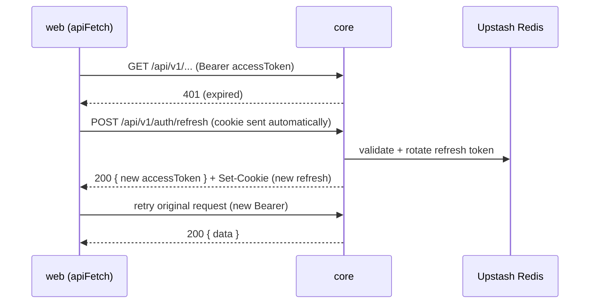
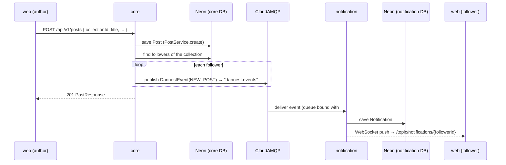
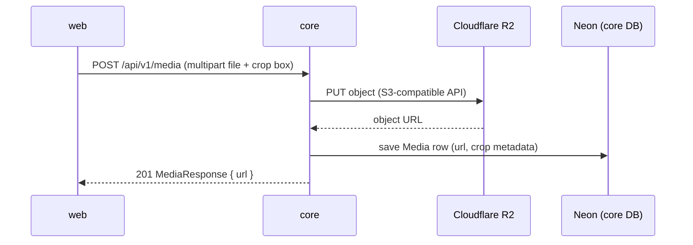

# 01 — Architecture

Everything DanNest is built from: our own services, the third-party services
they depend on, how they all talk to each other, and — for our own code
only — which libraries do the work.

---

## 1. All services & roles

### Ours

| Service | Role |
|---|---|
| **web** | Next.js frontend. The only thing users directly load in a browser. Talks to both backend APIs. |
| **services/core** | Main backend API — auth, users, collections, posts, comments, follows, media. Owns its own Postgres DB. Publishes events when something happens. |
| **services/notification** | Small backend API dedicated to notifications only. Owns a *separate* Postgres DB. Consumes events from Core and pushes them live over WebSocket. |

### Third-party / managed

| Service | Role |
|---|---|
| **Google Sign-In** | Identity provider. User logs in with Google in the browser; the frontend sends the resulting ID token to Core, which verifies it with Google once, then never talks to Google again for that session. |
| **Neon** | Managed Postgres. Hosts two separate databases — one for Core, one for Notification. |
| **CloudAMQP** | Managed RabbitMQ. The message broker Core publishes events to and Notification consumes from. |
| **Upstash** | Managed Redis. Used only by Core, to store refresh tokens server-side (so they can be revoked). |
| **Cloudflare R2** | S3-compatible object storage. Used only by Core, to store uploaded media (images). |
| **Render** | PaaS hosting for all three of our services (web, core, notification). Runs health checks, serves the live URLs. |
| **GitHub Actions** | CI/CD. On every push, checks the code and deploys whichever service(s) changed. |
| **Terraform** | Infrastructure-as-code tool (not a runtime service) that defines the Render resources above declaratively, in [infra/main.tf](../../infra/main.tf). |

### How they interact

*(Rendered by any Mermaid-aware Markdown viewer — VS Code's built-in preview
and GitHub both support it. If yours shows raw text instead of a diagram,
tell me and I'll switch formats.)*

`core` and `notification` never call each other directly and never share a
database — the RabbitMQ event above is the *only* link between them. `web`
is the only thing that talks to both backend services directly.

Plain-English version:

1. User logs into **web** via **Google Sign-In**.
2. **web** sends that Google token to **core**, which verifies it with Google once and issues DanNest's own JWT.
3. **web** uses that JWT for every REST call to **core** and **notification**.
4. **core** stores its data in its own **Neon** Postgres, refresh tokens in **Upstash** Redis, and uploaded images in **Cloudflare R2**.
5. Whenever something notification-worthy happens, **core** publishes an event to **CloudAMQP** (RabbitMQ). It doesn't know or care who's listening.
6. **notification** consumes that event, saves it to its own **Neon** Postgres, and pushes it live to **web** over a WebSocket.
7. **core** and **notification** never call each other directly and never share a database — RabbitMQ is the only link.
8. All three of our services are hosted on **Render**; **GitHub Actions** deploys them on every push; **Terraform** is what originally provisioned them on Render.

---

## 2. Libraries in our own services

### web (Next.js)

| Library | What it's for |
|---|---|
| `next` | The framework — routing, dev server, build/bundling. |
| `react` / `react-dom` | UI rendering. |
| `typescript` | Static typing across the app. |
| `@stomp/stompjs` | STOMP protocol client, for the live notification WebSocket. |
| `sockjs-client` | WebSocket transport (with fallback) that STOMP rides on. |
| `react-easy-crop` | Image cropping UI before uploading media. |
| `tailwindcss` | Utility-class CSS styling. |
| `eslint` | Linting (dev-time only, no runtime role). |

### services/core (Spring Boot)

| Library | What it's for |
|---|---|
| `spring-boot-starter-web` | REST controllers, embedded server, JSON handling. |
| `spring-boot-starter-validation` | `@Valid` request validation. |
| `spring-boot-starter-security` + `-oauth2-resource-server` | Issues and verifies our own JWTs (HS256). |
| `google-api-client` | Verifies the Google Sign-In ID token at login. |
| `spring-boot-starter-data-jpa` | ORM (Hibernate) + repository interfaces. |
| `postgresql` (JDBC driver) | Lets JPA talk to Postgres. |
| `flyway-core` / `flyway-database-postgresql` | Versioned SQL schema migrations. |
| `spring-boot-starter-data-redis` | Redis client, used to store refresh tokens. |
| `spring-boot-starter-amqp` | RabbitMQ client — publishes domain events. |
| `software.amazon.awssdk:s3` | S3-compatible client, pointed at Cloudflare R2 for media uploads. |
| `lombok` | Generates getters/setters/builders, less boilerplate. |
| `mapstruct` | Generates entity ↔ DTO mapping code. |
| `spring-boot-starter-actuator` | Health check endpoint (`/actuator/health`) for Render. |

### services/notification (Spring Boot)

Shares most of Core's stack (web, security/JWT verification, data-jpa,
Postgres driver, Flyway, amqp, Lombok, MapStruct, actuator) for the same
reasons, minus Redis/AWS/Google (not needed here), plus one addition:

| Library | What it's for |
|---|---|
| `spring-boot-starter-websocket` | STOMP-over-WebSocket support — pushes live notifications to connected browsers. |

---

## 3. Flows / Use Cases

Concrete, end-to-end walks through the system above — each one names the
actual endpoint/class involved so you can jump into the code.

### a) Login with Google

Access token lives in memory on the frontend — gone on page reload by
design. The refresh token is the httpOnly cookie, scoped to `/api/v1/auth`.

### b) Silent refresh (access token expired, session isn't)

The refresh token is single-use (rotated every call), so [api.ts](../../web/src/lib/api.ts)
coalesces concurrent refresh attempts into one in-flight request — otherwise
a losing second call would kill a session the first call just restored. If
the refresh cookie itself is missing/expired, `core` returns 401 again and
`web` logs the user out for real.

### c) Create a post → followers get notified live

`core` never waits on this — publishing is fire-and-forget
([NotificationService.java](../../services/core/src/main/java/com/dannest/notification/NotificationService.java)
in `core`, not to be confused with the whole `notification` service). It
also enforces "never notify yourself": if `recipientId == actorId` it's a
no-op. `COMMENT_REPLY` (replying to someone's comment) follows the exact
same shape — only the trigger and recipient differ (`CommentService.java`
notifies the parent comment's author instead of a list of followers).

### d) Upload media (e.g. a post's image)

`notification` is never involved here — media is entirely a `core` +
Cloudflare R2 concern.
