# 01 — Architecture

Everything DanNest is built from: our own services, the third-party services
they depend on, how they all talk to each other, and — for our own code
only — which libraries do the work.

---

## 1. All services & roles

### Ours

| Service | Role |
|---|---|
| **web** | Next.js frontend. The only thing users directly load in a browser. Talks to all three backend APIs directly. |
| **services/core** | Main backend API — auth, users, collections, posts, comments, follows, media (image upload/crop/delete, the only service that talks to Cloudflare R2), and its half of the membership saga (validate a purchase, grant/revoke access). Owns its own Postgres DB. Publishes events when something happens; also *consumes* the marketplace's saga replies. |
| **services/notification** | Small backend API dedicated to notifications only. Owns a *separate* Postgres DB. Consumes events from Core and pushes them live over WebSocket. |
| **services/marketplace** | Node + TypeScript (Express 5) backend for paid memberships — Stripe Connect onboarding, the Stripe Elements checkout, and the *money* half of the membership saga (charge, transfer the creator's cut, refund on failure). Owns its own **MongoDB** database. Talks to Core only over RabbitMQ. |

> Media was briefly a fourth service (`services/media`, Express + MongoDB); it was
> folded back into Core — see [Lesson 7](../lessons/lesson-7-remerging-media.md).
> The membership saga is written up in [Lesson 8](../lessons/lesson-8-membership-saga.md).

### Third-party / managed

| Service | Role |
|---|---|
| **Google Sign-In** | Identity provider. User logs in with Google in the browser; the frontend sends the resulting ID token to Core, which verifies it with Google once, then never talks to Google again for that session. |
| **Neon** | Managed Postgres. Hosts two separate databases — one for Core, one for Notification. |
| **MongoDB Atlas** | Managed MongoDB. The marketplace service's database — purchases, connected-account cache, and its outbox/inbox collections. No other service touches it. |
| **Stripe** | Payments. Used only by the marketplace: Connect (Express accounts for creator payouts), PaymentIntents + Elements (the buyer's card), Transfers (the creator's cut), Refunds (saga compensation), and webhooks (payment-succeeded → the saga's first step). Test mode only so far. |
| **CloudAMQP** | Managed RabbitMQ. The message broker all three backends use — Core and marketplace publish and consume the membership saga's events on it; Notification only consumes. |
| **Upstash** | Managed Redis. Used only by Core: refresh tokens (revocable sessions), the public feed's page cache, and the trending-posts sorted set. Notification does **not** use Redis — see [Lesson 6](../lessons/lesson-6-feed-cache-and-trending.md) §4 for why a Redis-backed fix there was built and then deliberately reverted. |
| **Cloudflare R2** | S3-compatible object storage. Used only by Core, to store uploaded media (images) — accessed via the AWS S3 SDK pointed at R2's endpoint. |
| **Render** | PaaS hosting for all four of our services (web, core, notification, marketplace). Runs health checks, serves the live URLs. |
| **GitHub Actions** | CI/CD. On every push, checks whichever service(s) changed, builds a Docker image, pushes it to GHCR, then tells Render to deploy that exact image. |
| **GHCR** | GitHub Container Registry. Holds the Docker images GitHub Actions builds, tagged by commit SHA — Render only ever pulls from here, it never builds from source. |
| **Terraform** | Infrastructure-as-code tool (not a runtime service) that defines the Render resources above declaratively, in [infra/main.tf](../../infra/main.tf). |

### How they interact

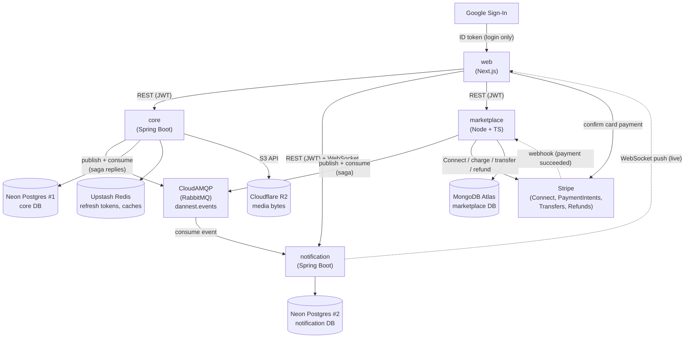

*(CI/CD — GitHub Actions building images to GHCR and deploying them to Render,
Terraform provisioning the Render services — is unchanged by the marketplace
addition; see [Lesson 2](../lessons/lesson-2-cicd.md) and the Deployment section
of the [README](../../README.md).)*

*(Rendered by any Mermaid-aware Markdown viewer — VS Code's built-in preview
and GitHub both support it. If yours shows raw text instead of a diagram,
tell me and I'll switch formats.)*

No two backends call each other directly or share a database — the RabbitMQ
events on `dannest.events` are the only link. `web` is the only thing that talks
to all three backend services directly.

Plain-English version:

1. User logs into **web** via **Google Sign-In**.
2. **web** sends that Google token to **core**, which verifies it with Google once and issues DanNest's own JWT.
3. **web** uses that JWT for every REST call to **core**, **notification**, and **marketplace** (they all verify the same HS256 signature).
4. **core** stores its data in its own **Neon** Postgres, refresh tokens + caches in **Upstash** Redis, and uploaded image bytes in **Cloudflare R2** (via the S3 API).
5. Whenever something notification-worthy happens, **core** publishes an event to **CloudAMQP** (RabbitMQ). It doesn't know or care who's listening.
6. **notification** consumes that event, saves it to its own **Neon** Postgres, and pushes it live to **web** over a WebSocket.
7. When a user buys a membership, **web** calls **marketplace** to start a purchase and confirms the card directly with **Stripe**. **marketplace** stores purchases in its own **MongoDB Atlas** database, and it and **core** run the rest as a saga — each publishing events the other consumes on `dannest.events`, never a direct call. See flow (k) below and [Lesson 8](../lessons/lesson-8-membership-saga.md).
8. All four of our services are hosted on **Render**; **GitHub Actions** builds and pushes a Docker image to **GHCR** on every push, then tells Render to deploy that exact image; **Terraform** is what originally provisioned the services on Render.

---

## 2. Libraries in our own services

### web (Next.js)

| Library | What it's for |
|---|---|
| `next` | The framework — routing, dev server, build/bundling. |
| `react` / `react-dom` | UI rendering. |
| `typescript` | Static typing across the app. |
| `@stomp/stompjs` | STOMP protocol client, for the live notification WebSocket. |
| `sockjs-client` | WebSocket transport (with fallback) that STOMP rides on. |
| `@stripe/stripe-js` | Loads Stripe's runtime script; the publishable-key client used by the checkout modal. |
| `@stripe/react-stripe-js` | React bindings — `<Elements>`, `<PaymentElement>`, `useStripe`/`useElements`, `confirmPayment`. Card data stays in Stripe's iframe. |
| `react-easy-crop` | Image cropping UI before uploading media. |
| `tailwindcss` | Utility-class CSS styling. |
| `eslint` | Linting (dev-time only, no runtime role). |

### services/core (Spring Boot)

| Library | What it's for |
|---|---|
| `spring-boot-starter-web` | REST controllers, embedded server, JSON handling. |
| `spring-boot-starter-validation` | `@Valid` request validation. |
| `spring-boot-starter-security` + `-oauth2-resource-server` | Issues and verifies our own JWTs (HS256). |
| `google-api-client` | Verifies the Google Sign-In ID token at login. |
| `spring-boot-starter-data-jpa` | ORM (Hibernate) + repository interfaces. |
| `postgresql` (JDBC driver) | Lets JPA talk to Postgres. |
| `flyway-core` / `flyway-database-postgresql` | Versioned SQL schema migrations. |
| `spring-boot-starter-data-redis` | Redis client — refresh tokens, the public feed's page cache, and the trending-posts leaderboard (sorted set). |
| `spring-boot-starter-amqp` | RabbitMQ client — publishes domain events. |
| `software.amazon.awssdk:s3` | S3-compatible client, pointed at Cloudflare R2 for media uploads. Pinned via BOM 2.28.x (2.30+ sends request checksums R2 rejects). |
| `lombok` | Generates getters/setters/builders, less boilerplate. |
| `mapstruct` | Generates entity ↔ DTO mapping code. |
| `spring-boot-starter-actuator` | Health check endpoint (`/actuator/health`) for Render. |

### services/notification (Spring Boot)

Shares most of Core's stack (web, security/JWT verification, data-jpa,
Postgres driver, Flyway, amqp, Lombok, MapStruct, actuator) for the same
reasons, minus Redis/AWS/Google (not needed here), plus one addition:

| Library | What it's for |
|---|---|
| `spring-boot-starter-websocket` | STOMP-over-WebSocket support — pushes live notifications to connected browsers. |

### services/marketplace (Node + TypeScript)

| Library | What it's for |
|---|---|
| `express` (5.x) | HTTP framework — routes, middleware. v5 so a rejected promise from an async handler forwards to the error middleware automatically. |
| `typescript` | Static typing; compiled with `tsc`, run with `tsx` in dev. |
| `mongoose` | MongoDB ODM — schemas, the connection, and `ClientSession` transactions for the outbox/inbox writes. |
| `stripe` | Official Stripe SDK — Connect accounts + account links, PaymentIntents, Transfers, Refunds, and `webhooks.constructEvent` (raw-body signature verification). |
| `amqplib` | Low-level RabbitMQ client — publishes the outbox rows and runs the reply listener (no Spring AMQP equivalent here, so queue/DLQ declaration is by hand). |
| `jsonwebtoken` | Verifies the same HS256 JWT Core issues — no login of its own. |
| `cors` | CORS for the browser calls from `web`. |
| `dotenv` | Loads `.env` in local dev (`config/env.ts` is the single read point). |

---

## 3. Flows / Use Cases

Concrete, end-to-end walks through the system above — each one names the
actual endpoint/class involved so you can jump into the code.

### a) Login with Google

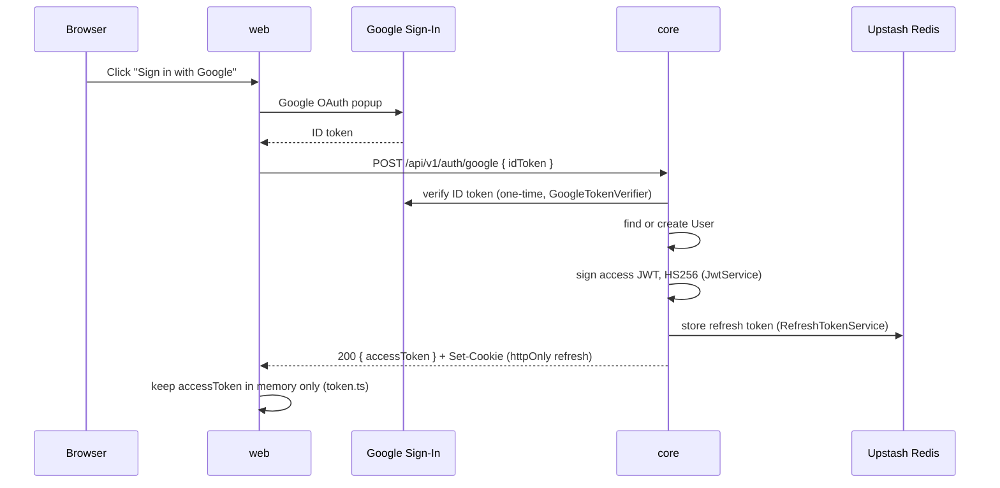

Access token lives in memory on the frontend — gone on page reload by
design. The refresh token is the httpOnly cookie, scoped to `/api/v1/auth`.

### b) Silent refresh (access token expired, session isn't)

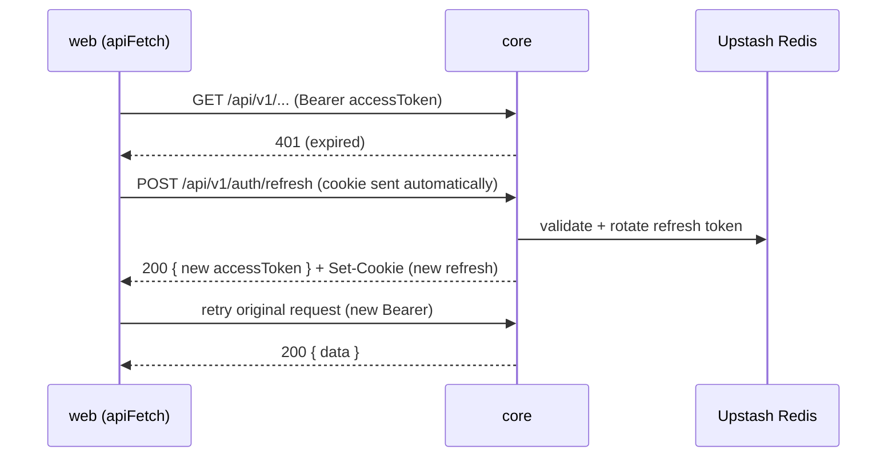

The refresh token is single-use (rotated every call), so [api.ts](../../web/src/lib/api.ts)
coalesces concurrent refresh attempts into one in-flight request — otherwise
a losing second call would kill a session the first call just restored. If
the refresh cookie itself is missing/expired, `core` returns 401 again and
`web` logs the user out for real.

### c) Create a post → followers get notified live

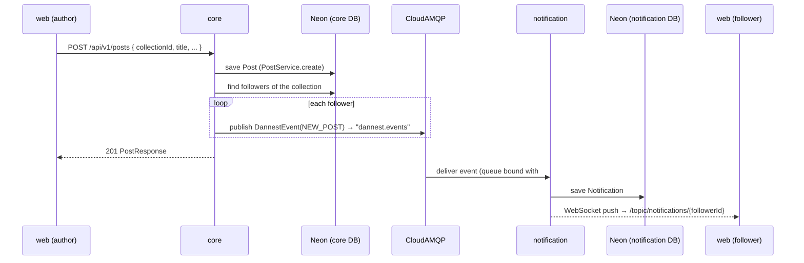

`core` never waits on this — publishing is fire-and-forget
([NotificationService.java](../../services/core/src/main/java/com/dannest/notification/NotificationService.java)
in `core`, not to be confused with the whole `notification` service). It
also enforces "never notify yourself": if `recipientId == actorId` it's a
no-op. `COMMENT_REPLY` (replying to someone's comment), `FOLLOW`
(following a collection), and `POST_LIKED` (liking a post) all follow the
exact same shape — only the trigger and recipient differ
(`CommentService.java` notifies the parent comment's author,
`FollowService.java` notifies the collection owner, `PostService.java`
notifies the post's author).

### d) Upload a post image, attach it to the post

Media upload and post creation are still **two calls from `web`** — one to
`/api/v1/media`, one to `/api/v1/posts` — even though both hit `core` now.
Keeping them separate means the cropper can upload as soon as the user picks a
file, and `core` still stores the id plus a denormalized `url`/crop snapshot on
`post_media` rather than joining to `media` on every read — see
[db-schema.md](db-schema.md)'s *Image crop* section.

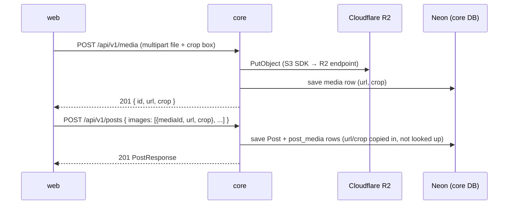

`notification` isn't involved at all.

### e) Re-crop an already-attached image (avatar, cover, or post image)

Still two calls, because two rows change: the `media` row's `crop`, then the
owning entity's denormalized snapshot. An explicit user action (open the
cropper, hit Save) — nothing syncs the copy automatically, and nothing needs
to: the `url` doesn't change on a crop edit, only `crop` does.

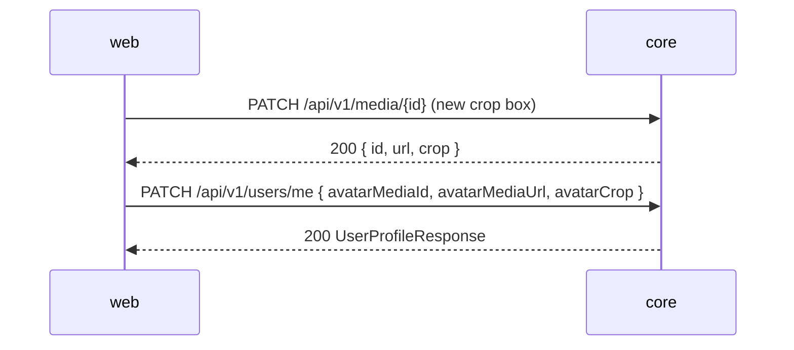

(Same shape for a collection's cover via `PATCH /api/v1/collections/{id}`, or
a post's images via `PATCH /api/v1/posts/{id}`.)

### f) Delete a media asset

Not yet wired into any `web` UI (`deleteMedia()` exists in
[media.ts](../../web/src/lib/media.ts) but nothing calls it — same status as
`deletePost()`). When it is, the shape is: clear the reference first (e.g.
`avatarMediaId: null`), then `DELETE /api/v1/media/{id}` (soft-delete the row,
free the R2 bytes) — that order means a failure on the second call never leaves
a row pointing at bytes that are about to disappear. `MediaService.delete` only
issues the R2 `DeleteObject` for `UPLOAD` assets, never `EXTERNAL` links.

### g) Load the public feed (Redis-cached)

Only `scope=FEED`'s default-sorted pages are cached, and only the *shared*
part — which post ids are on the page, and the total count. Per-user data
(likes, "did I like this") is never cached; it's recomputed live on every
request, hit or miss. See [Lesson 6](../lessons/lesson-6-feed-cache-and-trending.md)
§2 for why.

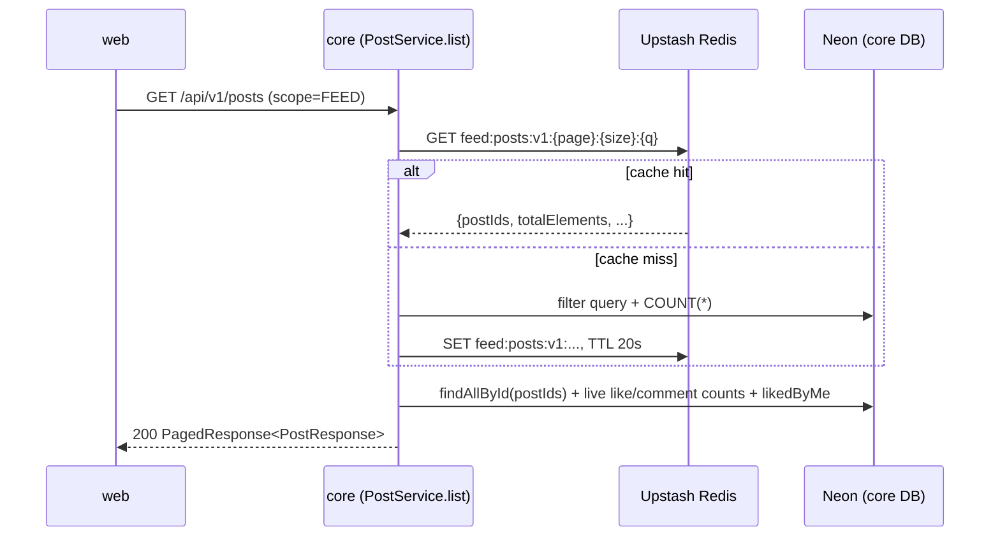

`PostService.create()` deletes every `feed:posts:v1:*` key after saving —
a new post changes page 0 and every total count, so it can't wait out the
TTL. Likes and comments never evict anything, because the part they'd
affect was never cached to begin with.

### h) Trending posts (Redis sorted set)

A Redis ZSET (`trending:posts`), not RabbitMQ — the activity that feeds
it (likes, comments) already happens inside `core`'s own request path, so
there's no other service to hand an event to.

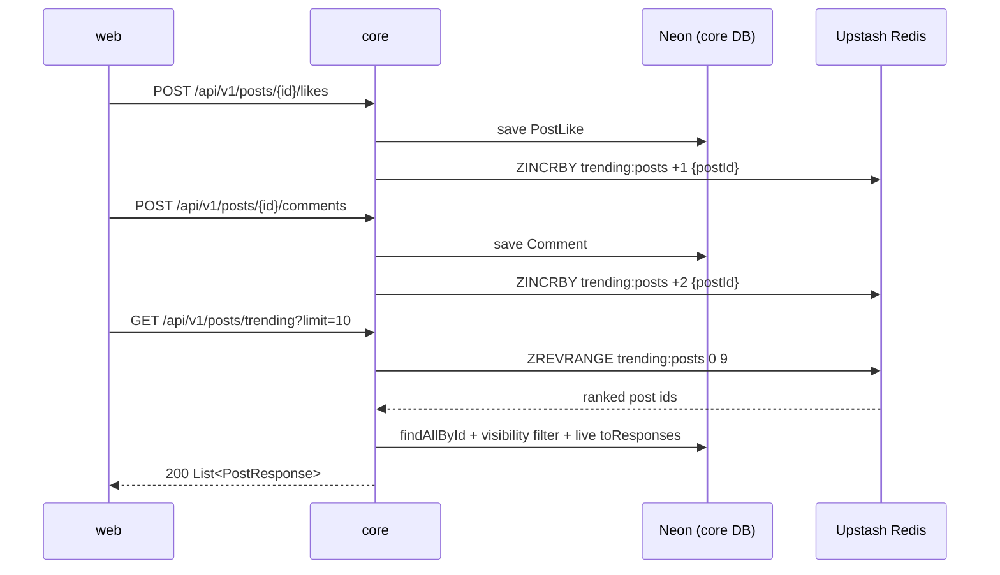

No time decay yet — scores only ever accumulate, a known limitation (see
[Lesson 6](../lessons/lesson-6-feed-cache-and-trending.md) §3).

### i) A creator connects Stripe (one-time, before selling)

All in `marketplace` — Core never sees any of this, it only ever hears a
`userId` back later.

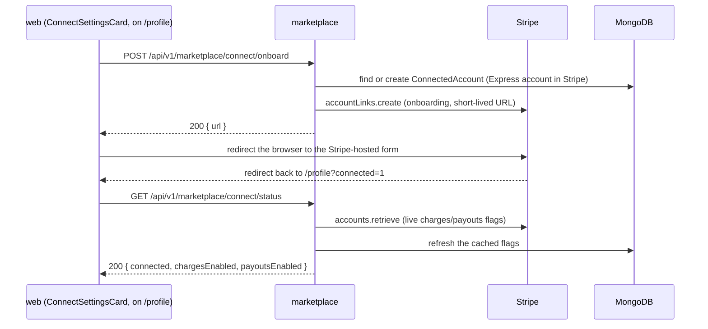

The `ConnectedAccount` row's `chargesEnabled` / `payoutsEnabled` are a **cache**
of Stripe's status, re-read every time status is checked — never the source of
truth. `web` only unlocks the "members-only" option in the collection form once
`payoutsEnabled` is `true`.

### j) Create a members-only collection

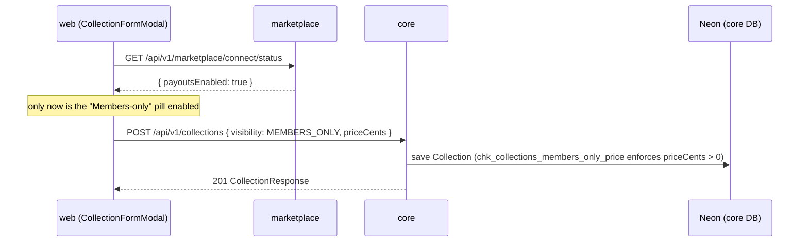

Core stores only the **price** and, later, **who was granted access** — never
anything about Stripe or money. `visibility` and `priceCents` are immutable once
set (enforced in `CollectionService.update`, not as a DB constraint — it's a
transition rule).

### k) Buy a membership — the saga

The one genuinely distributed transaction in the system: `web` + `marketplace` +
Stripe + `core`, no orchestrator, no 2PC. Full narrative, including every failure
mode and the bugs hit along the way, is
[Lesson 8](../lessons/lesson-8-membership-saga.md) — this is the reference version.

**Phase 1 — checkout (synchronous, no saga yet).**

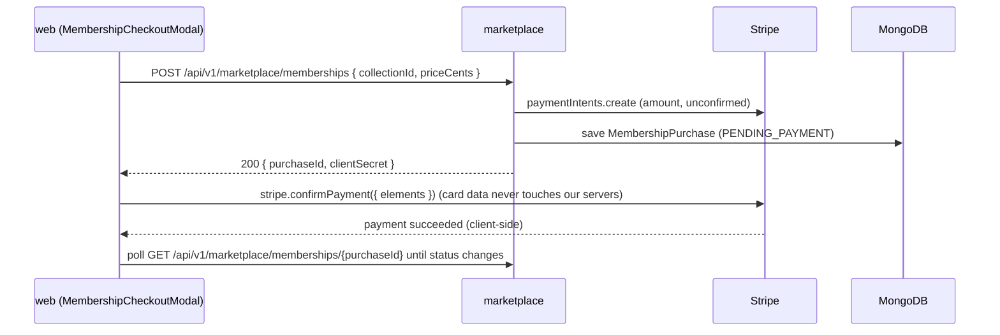

**Phase 2 — the saga (asynchronous, event-driven).** Starts only when Stripe's
*webhook* confirms the charge — not the browser's word for it.

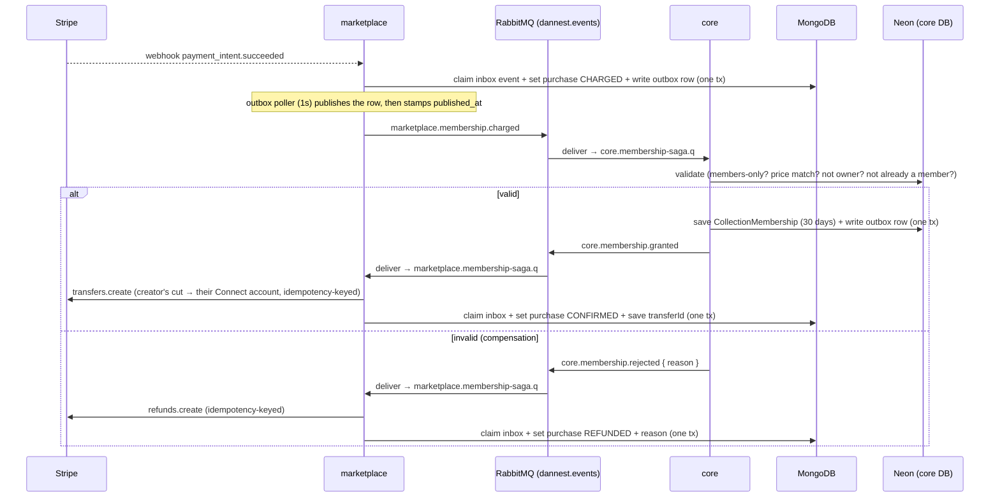

**Compensation #2 — Core granted, but the transfer fails** (creator never
finished Connect onboarding, or any other Stripe-side failure):

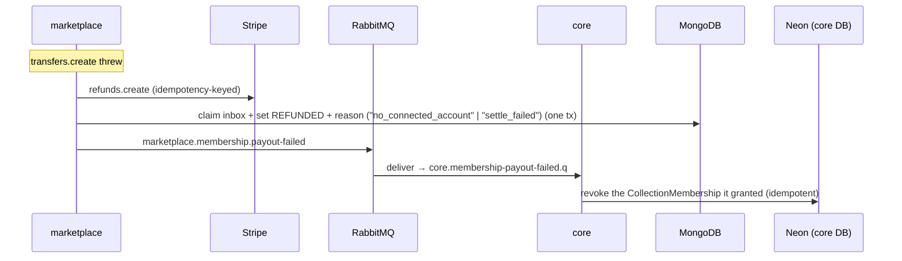

Key properties (all in [Lesson 8](../lessons/lesson-8-membership-saga.md)):

- **Transactional outbox** on both sides — the business row and the "I will
  publish this event" row commit in one DB transaction; a 1-second poller does
  the actual publish. An event is never lost because RabbitMQ was briefly
  unreachable.
- **Idempotent inbox** — `(event_id, consumer)` is unique; a handler claims the
  event *in the same transaction* as its effect. RabbitMQ's at-least-once
  redelivery can't produce a double grant or a double refund.
- **Do the fallible thing first.** Every marketplace handler makes its Stripe
  call *before* claiming the inbox event and committing local state. Claiming up
  front would mark the event done forever the moment any attempt hit a transient
  error — money moved or owed, with no record and no retry.
- **Stripe idempotency keys** on every outgoing transfer/refund — a genuine
  retry (two deliveries racing, a hand replay from a DLQ) reuses the original,
  never moves money twice.
- **Dead-letter queues** — every saga queue rejects-without-requeue on any
  handler exception (not just malformed JSON) and dead-letters it, instead of
  Spring AMQP's default infinite redelivery.

**Routing keys** (`<publisher>.<aggregate>.<past-tense-verb>`) and **queues**
(`<consumer>.<intent>.q` / `.dlq`):

| Routing key | Published by | Consumed on |
|---|---|---|
| `marketplace.membership.charged` | marketplace | `core.membership-saga.q` |
| `core.membership.granted` | core | `marketplace.membership-saga.q` |
| `core.membership.rejected` | core | `marketplace.membership-saga.q` |
| `marketplace.membership.payout-failed` | marketplace | `core.membership-payout-failed.q` |
