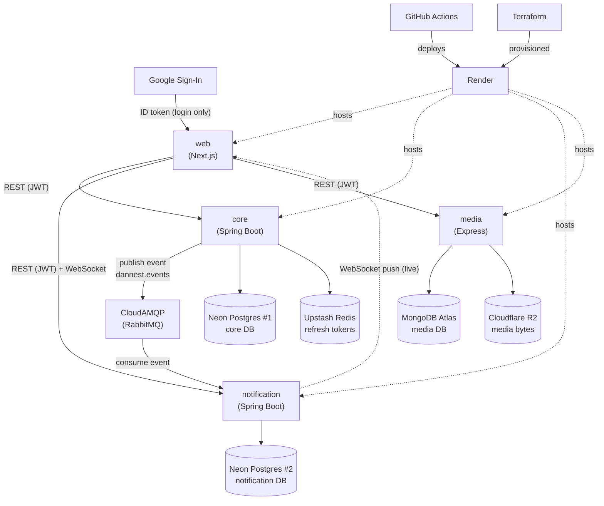
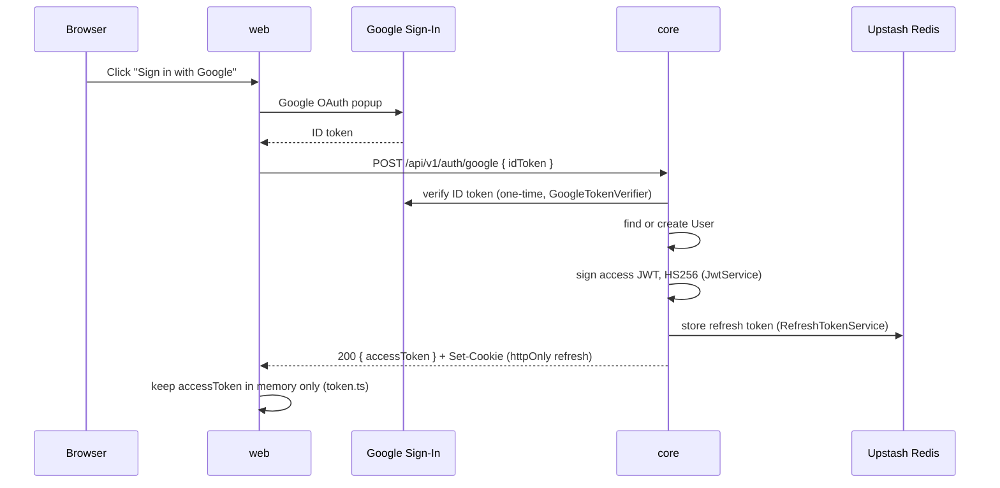
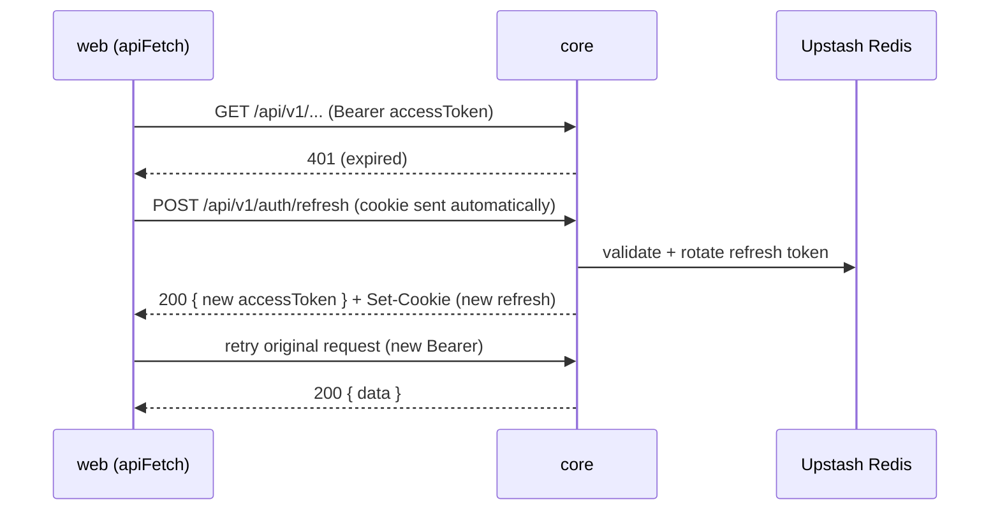
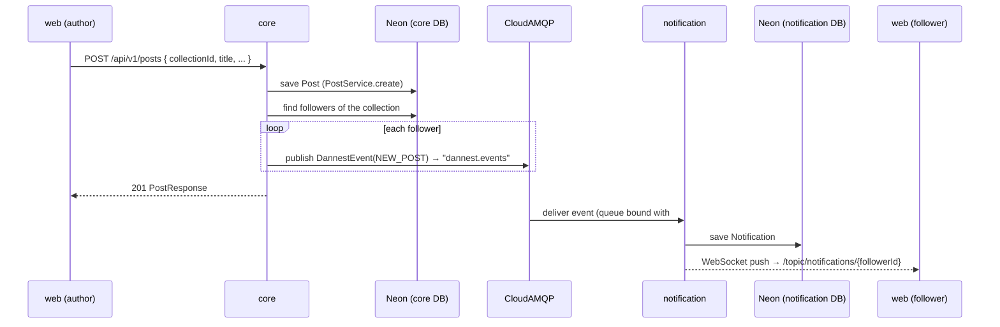
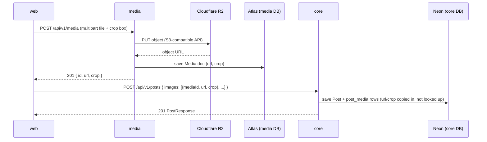
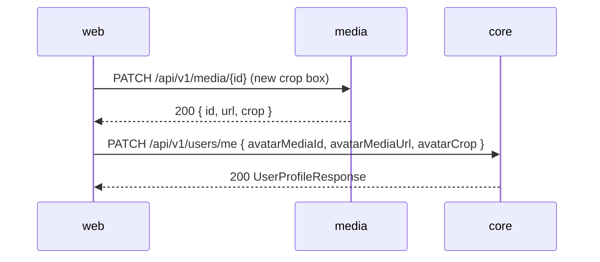
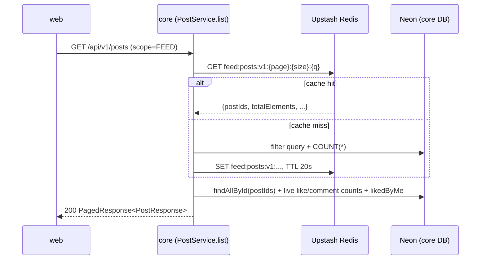
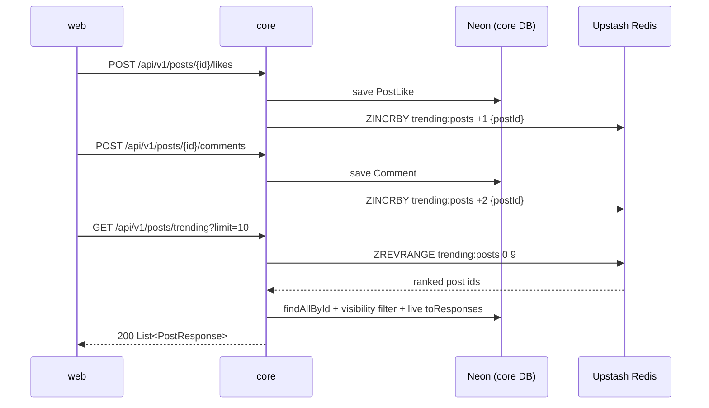

# 01 — Architecture

Everything DanNest is built from: our own services, the third-party services
they depend on, how they all talk to each other, and — for our own code
only — which libraries do the work.

---

## 1. All services & roles

### Ours

| Service | Role |
|---|---|
| **web** | Next.js frontend. The only thing users directly load in a browser. Talks to all three backend APIs directly. |
| **services/core** | Main backend API — auth, users, collections, posts, comments, follows. Owns its own Postgres DB. Publishes events when something happens. References media assets by opaque id + a denormalized url/crop snapshot — never queries services/media. |
| **services/notification** | Small backend API dedicated to notifications only. Owns a *separate* Postgres DB. Consumes events from Core and pushes them live over WebSocket. |
| **services/media** | Small backend API (Express + MongoDB) dedicated to image assets only — upload, crop, delete. The only service that talks to Cloudflare R2. Owns its own MongoDB, shares no database with Core. |

### Third-party / managed

| Service | Role |
|---|---|
| **Google Sign-In** | Identity provider. User logs in with Google in the browser; the frontend sends the resulting ID token to Core, which verifies it with Google once, then never talks to Google again for that session. |
| **Neon** | Managed Postgres. Hosts two separate databases — one for Core, one for Notification. |
| **MongoDB Atlas** | Managed MongoDB. Used only by services/media, for its media documents. |
| **CloudAMQP** | Managed RabbitMQ. The message broker Core publishes events to and Notification consumes from. |
| **Upstash** | Managed Redis. Used only by Core: refresh tokens (revocable sessions), the public feed's page cache, and the trending-posts sorted set. Notification does **not** use Redis — see [Lesson 6](../lessons/lesson-6-feed-cache-and-trending.md) §4 for why a Redis-backed fix there was built and then deliberately reverted. |
| **Cloudflare R2** | S3-compatible object storage. Used only by services/media, to store uploaded media (images). |
| **Render** | PaaS hosting for all four of our services (web, core, notification, media). Runs health checks, serves the live URLs. |
| **GitHub Actions** | CI/CD. On every push, checks the code and deploys whichever service(s) changed. |
| **Terraform** | Infrastructure-as-code tool (not a runtime service) that defines the Render resources above declaratively, in [infra/main.tf](../../infra/main.tf). |

### How they interact

*(Rendered by any Mermaid-aware Markdown viewer — VS Code's built-in preview
and GitHub both support it. If yours shows raw text instead of a diagram,
tell me and I'll switch formats.)*

`core`, `notification`, and `media` never call each other directly and never
share a database — the RabbitMQ event above is the only link between `core`
and `notification`; `core` and `media` have no link at all beyond the id +
denormalized url/crop snapshot `core` stores when a client attaches a media
asset (see flow (d) below). `web` is the only thing that talks to all three
backend services directly.

Plain-English version:

1. User logs into **web** via **Google Sign-In**.
2. **web** sends that Google token to **core**, which verifies it with Google once and issues DanNest's own JWT.
3. **web** uses that JWT for every REST call to **core**, **notification**, and **media**.
4. **core** stores its data in its own **Neon** Postgres and refresh tokens in **Upstash** Redis.
5. **media** stores its asset metadata in its own **MongoDB Atlas** and uploaded image bytes in **Cloudflare R2** — **core** never touches either.
6. Whenever something notification-worthy happens, **core** publishes an event to **CloudAMQP** (RabbitMQ). It doesn't know or care who's listening.
7. **notification** consumes that event, saves it to its own **Neon** Postgres, and pushes it live to **web** over a WebSocket.
8. **core**, **notification**, and **media** never call each other directly and never share a database.
9. All four of our services are hosted on **Render**; **GitHub Actions** deploys them on every push; **Terraform** is what originally provisioned them on Render.

---

## 2. Libraries in our own services

### web (Next.js)

| Library | What it's for |
|---|---|
| `next` | The framework — routing, dev server, build/bundling. |
| `react` / `react-dom` | UI rendering. |
| `typescript` | Static typing across the app. |
| `@stomp/stompjs` | STOMP protocol client, for the live notification WebSocket. |
| `sockjs-client` | WebSocket transport (with fallback) that STOMP rides on. |
| `react-easy-crop` | Image cropping UI before uploading media. |
| `tailwindcss` | Utility-class CSS styling. |
| `eslint` | Linting (dev-time only, no runtime role). |

### services/core (Spring Boot)

| Library | What it's for |
|---|---|
| `spring-boot-starter-web` | REST controllers, embedded server, JSON handling. |
| `spring-boot-starter-validation` | `@Valid` request validation. |
| `spring-boot-starter-security` + `-oauth2-resource-server` | Issues and verifies our own JWTs (HS256). |
| `google-api-client` | Verifies the Google Sign-In ID token at login. |
| `spring-boot-starter-data-jpa` | ORM (Hibernate) + repository interfaces. |
| `postgresql` (JDBC driver) | Lets JPA talk to Postgres. |
| `flyway-core` / `flyway-database-postgresql` | Versioned SQL schema migrations. |
| `spring-boot-starter-data-redis` | Redis client — refresh tokens, the public feed's page cache, and the trending-posts leaderboard (sorted set). |
| `spring-boot-starter-amqp` | RabbitMQ client — publishes domain events. |
| `lombok` | Generates getters/setters/builders, less boilerplate. |
| `mapstruct` | Generates entity ↔ DTO mapping code. |
| `spring-boot-starter-actuator` | Health check endpoint (`/actuator/health`) for Render. |

### services/notification (Spring Boot)

Shares most of Core's stack (web, security/JWT verification, data-jpa,
Postgres driver, Flyway, amqp, Lombok, MapStruct, actuator) for the same
reasons, minus Redis/AWS/Google (not needed here), plus one addition:

| Library | What it's for |
|---|---|
| `spring-boot-starter-websocket` | STOMP-over-WebSocket support — pushes live notifications to connected browsers. |

### services/media (Express + TypeScript)

A different stack on purpose — see [Lesson 4](../lessons/lesson-4-microservices.md)
for why splitting this out was worth doing even at this project's scale.

| Library | What it's for |
|---|---|
| `express` | REST routes, middleware, JSON handling. |
| `typescript` | Static typing; compiled to JS at build time (`tsc`), run with `tsx` in dev. |
| `mongoose` | ODM for MongoDB — schema + queries for the `media` collection. |
| `jsonwebtoken` | Verifies the same HS256 JWT Core issues (shares `JWT_SECRET`) — no login of its own. |
| `multer` | Parses multipart file uploads. |
| `@aws-sdk/client-s3` | S3-compatible client, pointed at Cloudflare R2 for media uploads (same bucket Core used pre-split). |
| `cors` | Allows the web origin to call this API directly (same `CORS_ALLOWED_ORIGINS` pattern as Core/Notification). |

---

## 3. Flows / Use Cases

Concrete, end-to-end walks through the system above — each one names the
actual endpoint/class involved so you can jump into the code.

### a) Login with Google

Access token lives in memory on the frontend — gone on page reload by
design. The refresh token is the httpOnly cookie, scoped to `/api/v1/auth`.

### b) Silent refresh (access token expired, session isn't)

The refresh token is single-use (rotated every call), so [api.ts](../../web/src/lib/api.ts)
coalesces concurrent refresh attempts into one in-flight request — otherwise
a losing second call would kill a session the first call just restored. If
the refresh cookie itself is missing/expired, `core` returns 401 again and
`web` logs the user out for real.

### c) Create a post → followers get notified live

`core` never waits on this — publishing is fire-and-forget
([NotificationService.java](../../services/core/src/main/java/com/dannest/notification/NotificationService.java)
in `core`, not to be confused with the whole `notification` service). It
also enforces "never notify yourself": if `recipientId == actorId` it's a
no-op. `COMMENT_REPLY` (replying to someone's comment), `FOLLOW`
(following a collection), and `POST_LIKED` (liking a post) all follow the
exact same shape — only the trigger and recipient differ
(`CommentService.java` notifies the parent comment's author,
`FollowService.java` notifies the collection owner, `PostService.java`
notifies the post's author).

### d) Upload a post image, attach it to the post

Media is a separate service now — creating a post that includes an image is
**two calls from `web`**, never a call from `core` to `media` or back. `core`
stores the id plus a denormalized `url`/crop snapshot it's handed, not a live
reference — see [db-schema.md](db-schema.md)'s *Image crop* section for why.

`core` never calls `media`, and `media` never calls `core` — `web` is the one
holding both responses and sequencing the two calls. `notification` isn't
involved at all.

### e) Re-crop an already-attached image (avatar, cover, or post image)

Same two-call shape, opposite motivation: `media` owns the mutation, `core`
just needs its stale snapshot refreshed. This is an explicit action the user
triggers (open the cropper again, hit Save) — nothing keeps the two in sync
automatically, and nothing needs to: `media`'s `url` doesn't change on a crop
edit, only `crop` does, and `core` only had a copy of `crop` in the first place.

(Same shape for a collection's cover via `PATCH /api/v1/collections/{id}`, or
a post's images via `PATCH /api/v1/posts/{id}`.)

### f) Delete a media asset

Not yet wired into any `web` UI (`deleteMedia()` exists in
[media.ts](../../web/src/lib/media.ts) but nothing calls it — same status as
`deletePost()`). When it is, the shape is: `core` first (clear the reference,
e.g. `avatarMediaId: null`), then `media` (soft-delete the doc, free the R2
bytes) — that order means a failure on the second call never leaves `core`
pointing at bytes that are about to disappear.

### g) Load the public feed (Redis-cached)

Only `scope=FEED`'s default-sorted pages are cached, and only the *shared*
part — which post ids are on the page, and the total count. Per-user data
(likes, "did I like this") is never cached; it's recomputed live on every
request, hit or miss. See [Lesson 6](../lessons/lesson-6-feed-cache-and-trending.md)
§2 for why.

`PostService.create()` deletes every `feed:posts:v1:*` key after saving —
a new post changes page 0 and every total count, so it can't wait out the
TTL. Likes and comments never evict anything, because the part they'd
affect was never cached to begin with.

### h) Trending posts (Redis sorted set)

A Redis ZSET (`trending:posts`), not RabbitMQ — the activity that feeds
it (likes, comments) already happens inside `core`'s own request path, so
there's no other service to hand an event to.

No time decay yet — scores only ever accumulate, a known limitation (see
[Lesson 6](../lessons/lesson-6-feed-cache-and-trending.md) §3).
