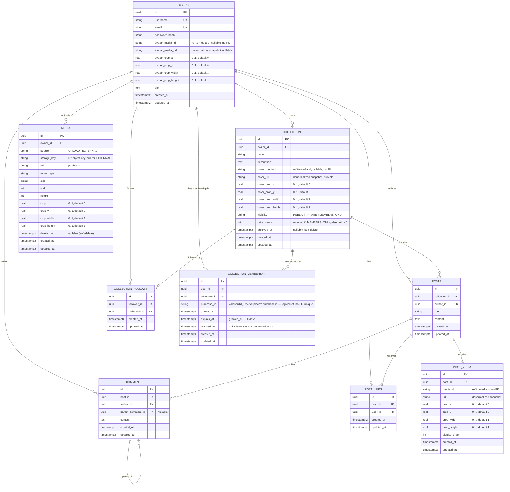

# DanNest — Database Schema

DanNest is split into three backend services, each owning its **own** database —
see [Lesson 4](../lessons/lesson-4-microservices.md). This doc covers, in order:

- **Core's** Postgres (social + collections + media + membership grants) — most of this doc
- **Notification's** Postgres — one small table, near the bottom
- **Marketplace's** MongoDB (purchases + Stripe-account cache + outbox/inbox) — [Lesson 8](../lessons/lesson-8-membership-saga.md)

No two services share a schema, and no database has a foreign key into another's.

> Media used to be a fourth service (`services/media`, MongoDB) — it was folded
> back into Core in [Lesson 7](../lessons/lesson-7-remerging-media.md). Core owns
> the `media` table again (migration
> [`V9__media_back_into_core.sql`](../../services/core/src/main/resources/db/migration/V9__media_back_into_core.sql)).

## Core's database

Source of truth for the fields is `dannest-project-spec.md`; the tables are
created by the Flyway migrations in
[`services/core/src/main/resources/db/migration/`](../../services/core/src/main/resources/db/migration/)
and mapped by JPA entities under `services/core/src/main/java/com/dannest/`.

## Base entity

Every entity extends a single `@MappedSuperclass` **`BaseEntity`** — so all tables
share `id` (UUID), `created_at`, and `updated_at`. The timestamps are filled
automatically by Spring Data JPA auditing (`@CreatedDate` / `@LastModifiedDate`).

## ER diagram

**The `media` table's history** — it lived here through V6, was dropped by
[V7\_\_media_split.sql](../../services/core/src/main/resources/db/migration/V7__media_split.sql)
when media became its own service (which backfilled every reference into the
denormalized columns above), then recreated by
[V9\_\_media_back_into_core.sql](../../services/core/src/main/resources/db/migration/V9__media_back_into_core.sql)
when that service was folded back in ([Lesson 7](../lessons/lesson-7-remerging-media.md)).
The denormalized `*_url` / `*_crop_*` columns were kept as-is through the re-merge —
see *Image crop* and *Notes* below.

## Tables

| Table | Purpose | Notes |
| --- | --- | --- |
| `media` | an uploaded image (bytes in Cloudflare R2) or external link | `owner_id` → `users`; `source` UPLOAD/EXTERNAL; `storage_key` (R2 key, null for EXTERNAL); `url` + `crop_*`; `deleted_at` (soft-delete) |
| `users` | accounts | `username` + `email` unique; `avatar_media_id` (`varchar(64)`, no FK) + denormalized `avatar_media_url`/crop |
| `collections` | themed groups | `owner_id` → `users`; `cover_media_id` (`varchar(64)`, no FK) + denormalized `cover_url`/crop; `visibility` PUBLIC/PRIVATE; `archived_at` (soft-delete) |
| `posts` | a post in a collection | `collection_id`, `author_id` |
| `post_media` | post ↔ image join | own `id`, ordered by `display_order`, `media_id` (`varchar(64)`, no FK) + denormalized `url`/crop, unique `(post_id, media_id)` |
| `comments` | replies on a post | `parent_comment_id` (nullable) → nested threads |
| `post_likes` | a user's like | own `id`, unique `(post_id, user_id)` |
| `collection_follows` | a user following a collection (to be notified of new posts) | `follower_id` → `users`; `collection_id` → `collections`; unique `(follower_id, collection_id)` |
| `collection_membership` | a granted paid membership (the saga's result on Core's side) | `user_id` / `collection_id` → those tables; `purchase_id` `varchar(64)` unique (marketplace's id, no FK); partial-unique `(user_id, collection_id) where revoked_at is null` — at most one *active* membership, re-purchase after expiry is fine |
| `outbox_event` | transactional outbox — one row per domain event Core will publish, written in the business transaction | `published_at` null until a 1s poller sends it; `payload` is pre-serialized `text`; see [Lesson 8](../lessons/lesson-8-membership-saga.md) |
| `inbox_event` | idempotent consumer — "have I processed this event already" | PK `(event_id, consumer)`; a listener inserts here in the *same* transaction as its effect, `ON CONFLICT DO NOTHING` |

## Image crop (framing)

Framing is **denormalized onto whichever table references the image** — a
`crop_x/y/width/height` quartet per reference (`avatar_crop_*` on `users`,
`cover_crop_*` on `collections`, unprefixed on `post_media`) — copied once, at
write time, from the crop the media endpoint returned for that asset. Added by
[`V3__archive_and_media_crop.sql`](../../services/core/src/main/resources/db/migration/V3__archive_and_media_crop.sql)
(originally on the `media` table) and moved out to these columns by
[`V7__media_split.sql`](../../services/core/src/main/resources/db/migration/V7__media_split.sql);
kept there when media moved back in.

- `crop_x, crop_y, crop_width, crop_height` — the visible rectangle as fractions
  (0..1) of the original image ([ImageCrop.java](../../services/core/src/main/java/com/dannest/common/ImageCrop.java)).
  This alone is enough to render.
- **Zoom is not persisted.** The cropper UI ([ImageCropper.tsx](../../web/src/components/ImageCropper.tsx),
  built on `react-easy-crop`) tracks zoom client-side only while the user is
  actively dragging/scaling — it's converted to the equivalent crop rectangle
  before being sent to the API ([CropDto.java](../../services/core/src/main/java/com/dannest/common/CropDto.java)
  only has `x, y, width, height`). Re-opening the cropper later starts from
  that rectangle, not a remembered zoom level.
- **Render**: apply via CSS now (`object-position` + scale); the same metadata maps
  directly to an image CDN (e.g. Cloudflare Images) later with no schema change.
- **Re-cropping an already-attached image** is an explicit two-call action from the
  frontend — `PATCH /api/v1/media/{id}` for the new crop, then re-save the owning
  entity (post/profile/collection) with the fresh snapshot. Core never re-resolves
  a crop on its own; see [architecture-flows.md](architecture-flows.md).

## Notes

- **Media references, no FK** — `avatar_media_id`/`cover_media_id`/`post_media.media_id`
  are `varchar(64)` (widened from `uuid` in V8, while media lived in a separate
  service with Mongo ObjectId ids) and carry **no foreign key** to `media`. V9 did
  not re-add one: pre-existing rows point at ObjectIds that no longer resolve, and
  the denormalized snapshot is what actually renders regardless. New media rows get
  Core-generated UUID ids.
- **Denormalized snapshots, not live joins** — the `*_url`/`*_crop_*` columns are
  copied once when the reference is set and never synced afterward. A media
  asset's `url` is treated as effectively immutable once attached; soft-deleting
  the underlying `media` row never touches these columns (see
  [architecture-flows.md](architecture-flows.md)). Reads never join to `media`.
- **Deletes** — `post_media`, `comments`, `post_likes` cascade when their `post` is deleted.
- **Not yet** (spec *Future Features*): saves/bookmarks, tags, search.

## Notification service's database

A separate, much smaller Postgres owned by `services/notification` —
[`services/notification/src/main/resources/db/migration/V1__init.sql`](../../services/notification/src/main/resources/db/migration/V1__init.sql).
One table, **no foreign keys to Core's tables** (different database — Postgres
can't enforce a FK across a network boundary, and this service shouldn't be
querying Core's database anyway):

| Column | Type | Notes |
| --- | --- | --- |
| `id` | uuid PK | |
| `recipient_id`, `actor_id` | uuid | reference `users.id` in Core's DB — logical only, no FK |
| `actor_username`, `actor_avatar_url` | text | **denormalized** — copied from the event at write time, not looked up |
| `type` | varchar(20) | `NEW_POST` \| `COMMENT_REPLY` \| `FOLLOW` \| `POST_LIKED` |
| `collection_id`, `collection_name` | uuid, text | `collection_name` denormalized, same reason as actor fields |
| `post_id`, `comment_id` | uuid, nullable | `post_id` nullable since [V2\_\_nullable_post_id.sql](../../services/notification/src/main/resources/db/migration/V2__nullable_post_id.sql) — `FOLLOW` has no post; `comment_id` nullable for anything but a reply |
| `read_at` | timestamptz, nullable | |
| `created_at`, `updated_at` | timestamptz | |

Filled entirely by consuming `DannestEvent` messages off RabbitMQ (see
[Lesson 4](../lessons/lesson-4-microservices.md)) — this service never queries Core's
database to render a notification, which is *why* the denormalized columns
exist instead of just storing IDs.

## Media (in Core)

Media is a Core table again — [`Media.java`](../../services/core/src/main/java/com/dannest/media/Media.java),
created by [`V9__media_back_into_core.sql`](../../services/core/src/main/resources/db/migration/V9__media_back_into_core.sql).
Core owns each image asset's full lifecycle: upload (bytes → Cloudflare R2 via the
S3 SDK), crop-edit, soft-delete. See the `MEDIA` block in the ER diagram above for
columns.

Even though `media` now lives in the same database, reads still don't join to it —
every reference (`users.avatar_media_id`, `collections.cover_media_id`,
`post_media.media_id`) carries a denormalized `url`/crop snapshot captured at write
time. That started as a cross-service necessity (V7) and was kept because it also
keeps feed/profile reads join-free and a soft-deleted asset from breaking an
existing attachment. See the *Image crop* and *Notes* sections above, and the full
read/write flow in [architecture-flows.md](architecture-flows.md).

## Membership & the saga (in Core)

Migrations [`V10`](../../services/core/src/main/resources/db/migration/V10__members_only_collections.sql)
(members-only collections + `collection_membership`),
[`V11`](../../services/core/src/main/resources/db/migration/V11__outbox_inbox.sql)
(`outbox_event` + `inbox_event`), and
[`V12`](../../services/core/src/main/resources/db/migration/V12__purchase_id_as_text.sql)
(widen `purchase_id` to `varchar(64)` — it holds a Mongo ObjectId, same class of
fix as V8 did for `media_id`).

- **`collections.price_cents`** — nullable, with a CHECK constraint: null unless
  `visibility = 'MEMBERS_ONLY'`, `> 0` when it is. The app additionally makes both
  fields immutable once set (a transition rule, not a static constraint).
- **`collection_membership`** — Core's record of a granted purchase. It stores
  *only* who has access, from when, until when, and the marketplace `purchase_id`
  to correlate. Nothing about Stripe, the amount paid, or the buyer's card —
  Core never sees any of that. `revoke()` (sets `revoked_at`) is idempotent, so
  redelivery of the payout-failed event is safe.
- **`outbox_event` / `inbox_event`** — the transactional-outbox and
  idempotent-consumer tables. `outbox_event` rows are written in the same
  transaction as the `collection_membership` change; `OutboxPoller` publishes
  unsent rows every second and stamps `published_at`. `inbox_event` is claimed by
  a saga listener *inside* the transaction that applies the event's effect, so an
  at-least-once redelivery can't double-apply. Marketplace has the exact same two
  structures in MongoDB (below). Full mechanism: [Lesson 8](../lessons/lesson-8-membership-saga.md).

## Marketplace service's database (MongoDB)

Owned by `services/marketplace` — a MongoDB database (Atlas in production, a
local `mongod` or Atlas cluster in dev). Mongoose schemas under
[`services/marketplace/src/`](../../services/marketplace/src/); no migration
files — indexes are declared on the schema and created on connect. **No
references to any other database.**

### `membershippurchases`

The saga's state on the money side. One document per checkout attempt.

| Field | Type | Notes |
| --- | --- | --- |
| `_id` | ObjectId | this is the `purchaseId` / `purchase_id` everywhere else |
| `buyerId`, `collectionId` | string | Core `users.id` / `collections.id` — logical only |
| `priceCents` | number | what Stripe was told to charge |
| `stripePaymentIntentId` | string | the PaymentIntent created at checkout |
| `stripeTransferId` | string \| null | set once the creator's cut is transferred |
| `status` | string | `PENDING_PAYMENT` → `PAYMENT_FAILED` \| `CHARGED` → `CONFIRMED` \| `REFUNDED` |
| `reason` | string \| null | Core's rejection reason, `"no_connected_account"`, `"settle_failed"`, or Stripe's decline message |
| `createdAt`, `updatedAt` | Date | Mongoose timestamps |

### `connectedaccounts`

A creator's Stripe Express account. One per user, created lazily on first
onboarding.

| Field | Type | Notes |
| --- | --- | --- |
| `userId` | string | unique — Core `users.id` |
| `stripeAccountId` | string | the Stripe `acct_…` id |
| `chargesEnabled`, `payoutsEnabled` | boolean | a **cache** of Stripe's account status, re-read live on every status check — never the source of truth |
| `createdAt`, `updatedAt` | Date | |

### `outboxevents` / `inboxevents`

Mongo mirrors of Core's `outbox_event` / `inbox_event` — same mechanism, adapted
to a document store (payload is a native object, not pre-serialized text).

- **`outboxevents`** — `aggregateType`, `aggregateId`, `eventType` (also the
  RabbitMQ routing key), `payload` (object), `publishedAt` (null until sent),
  `attempts`, `lastError`. Partial index on `{ createdAt: 1 }` where
  `publishedAt: null` — the poller's only query. Written inside a
  `session.withTransaction` alongside the purchase change.
- **`inboxevents`** — `{ eventId, consumer }` unique. Claimed with an insert
  (catch duplicate-key → already processed) inside the same transaction as the
  effect.
