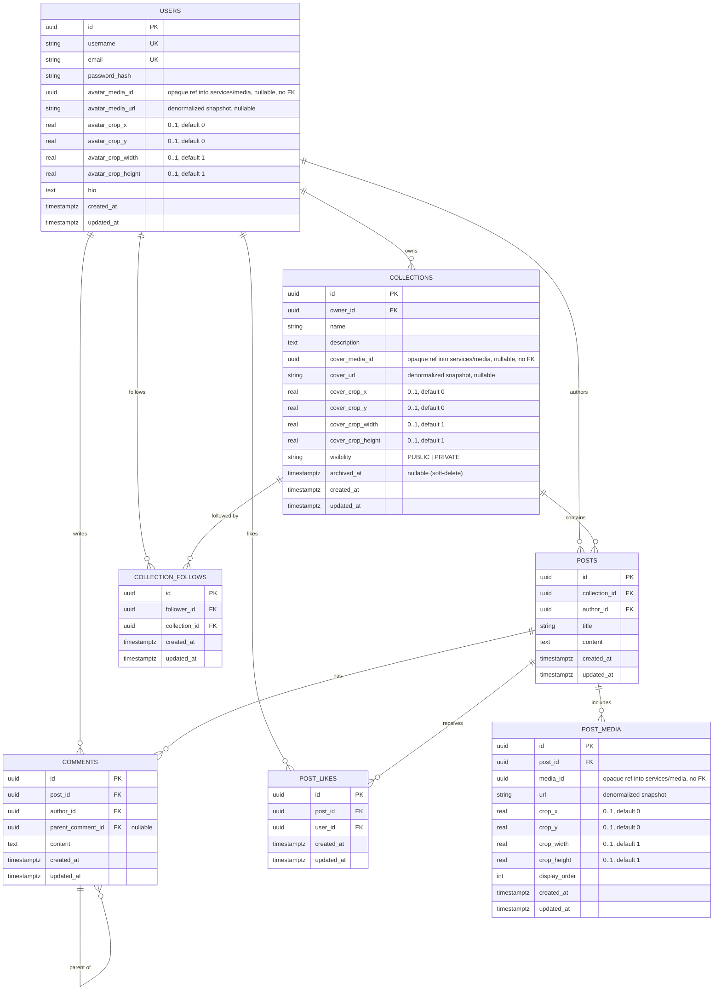

# DanNest — Database Schema

DanNest is split into three services, each owning its **own** database — see
[Lesson 4](../lessons/lesson-4-microservices.md). This doc covers **Core's**
Postgres database (social + collections); the notification service's much
smaller Postgres schema is at the bottom. **services/media** owns its media
assets in a separate MongoDB — see its own section below; Core no longer has
a `media` table at all.

## Core's database

Source of truth for the fields is `dannest-project-spec.md`; the tables are
created by the Flyway migrations in
[`services/core/src/main/resources/db/migration/`](../../services/core/src/main/resources/db/migration/)
and mapped by JPA entities under `services/core/src/main/java/com/dannest/`.

## Base entity

Every entity extends a single `@MappedSuperclass` **`BaseEntity`** — so all tables
share `id` (UUID), `created_at`, and `updated_at`. The timestamps are filled
automatically by Spring Data JPA auditing (`@CreatedDate` / `@LastModifiedDate`).

## ER diagram

**No `media` table** — it lived here through migration V6, then
[V7\_\_media_split.sql](../../services/core/src/main/resources/db/migration/V7__media_split.sql)
backfilled every reference into the denormalized columns above and dropped it.
Media assets now live entirely in **services/media**'s MongoDB (see below).

## Tables

| Table | Purpose | Notes |
| --- | --- | --- |
| `users` | accounts | `username` + `email` unique; `avatar_media_id` (opaque, no FK) + denormalized `avatar_media_url`/crop |
| `collections` | themed groups | `owner_id` → `users`; `cover_media_id` (opaque, no FK) + denormalized `cover_url`/crop; `visibility` PUBLIC/PRIVATE; `archived_at` (soft-delete) |
| `posts` | a post in a collection | `collection_id`, `author_id` |
| `post_media` | post ↔ image join | own `id`, ordered by `display_order`, `media_id` (opaque, no FK) + denormalized `url`/crop, unique `(post_id, media_id)` |
| `comments` | replies on a post | `parent_comment_id` (nullable) → nested threads |
| `post_likes` | a user's like | own `id`, unique `(post_id, user_id)` |
| `collection_follows` | a user following a collection (to be notified of new posts) | `follower_id` → `users`; `collection_id` → `collections`; unique `(follower_id, collection_id)` |

## Image crop (framing)

Framing is **denormalized onto whichever table references the image** — a
`crop_x/y/width/height` quartet per reference (`avatar_crop_*` on `users`,
`cover_crop_*` on `collections`, unprefixed on `post_media`) — copied once, at
write time, from the crop services/media returned for that asset. Added by
[`V3__archive_and_media_crop.sql`](../../services/core/src/main/resources/db/migration/V3__archive_and_media_crop.sql)
(originally on the now-dropped `media` table) and moved out to these columns by
[`V7__media_split.sql`](../../services/core/src/main/resources/db/migration/V7__media_split.sql).

- `crop_x, crop_y, crop_width, crop_height` — the visible rectangle as fractions
  (0..1) of the original image ([ImageCrop.java](../../services/core/src/main/java/com/dannest/common/ImageCrop.java)).
  This alone is enough to render.
- **Zoom is not persisted.** The cropper UI ([ImageCropper.tsx](../../web/src/components/ImageCropper.tsx),
  built on `react-easy-crop`) tracks zoom client-side only while the user is
  actively dragging/scaling — it's converted to the equivalent crop rectangle
  before being sent to the API ([CropDto.java](../../services/core/src/main/java/com/dannest/common/CropDto.java)
  only has `x, y, width, height`). Re-opening the cropper later starts from
  that rectangle, not a remembered zoom level.
- **Render**: apply via CSS now (`object-position` + scale); the same metadata maps
  directly to an image CDN (e.g. Cloudflare Images) later with no schema change.
- **Re-cropping an already-attached image** is an explicit two-call action from the
  frontend — `PATCH` services/media for the new crop, then re-save the owning
  entity (post/profile/collection) with the fresh snapshot. Core never re-resolves
  a crop on its own; see [architecture-flows.md](architecture-flows.md).

## Notes

- **Opaque media references, no FK** — `avatar_media_id`/`cover_media_id`/`post_media.media_id`
  point at documents in services/media's MongoDB, a different database Postgres
  can't enforce a FK across (same reasoning as `notification.actor_id` below).
- **Denormalized snapshots, not live joins** — the `*_url`/`*_crop_*` columns are
  copied once when the reference is set and never synced afterward. A media
  asset's `url` is treated as effectively immutable once attached; deleting the
  underlying asset in services/media never touches these columns (it's a
  soft-delete there — see [architecture-flows.md](architecture-flows.md)).
- **Deletes** — `post_media`, `comments`, `post_likes` cascade when their `post` is deleted.
- **Not yet** (spec *Future Features*): saves/bookmarks, tags, search.

## Notification service's database

A separate, much smaller Postgres owned by `services/notification` —
[`services/notification/src/main/resources/db/migration/V1__init.sql`](../../services/notification/src/main/resources/db/migration/V1__init.sql).
One table, **no foreign keys to Core's tables** (different database — Postgres
can't enforce a FK across a network boundary, and this service shouldn't be
querying Core's database anyway):

| Column | Type | Notes |
| --- | --- | --- |
| `id` | uuid PK | |
| `recipient_id`, `actor_id` | uuid | reference `users.id` in Core's DB — logical only, no FK |
| `actor_username`, `actor_avatar_url` | text | **denormalized** — copied from the event at write time, not looked up |
| `type` | varchar(20) | `NEW_POST` \| `COMMENT_REPLY` \| `FOLLOW` \| `POST_LIKED` |
| `collection_id`, `collection_name` | uuid, text | `collection_name` denormalized, same reason as actor fields |
| `post_id`, `comment_id` | uuid, nullable | `post_id` nullable since [V2\_\_nullable_post_id.sql](../../services/notification/src/main/resources/db/migration/V2__nullable_post_id.sql) — `FOLLOW` has no post; `comment_id` nullable for anything but a reply |
| `read_at` | timestamptz, nullable | |
| `created_at`, `updated_at` | timestamptz | |

Filled entirely by consuming `DannestEvent` messages off RabbitMQ (see
[Lesson 4](../lessons/lesson-4-microservices.md)) — this service never queries Core's
database to render a notification, which is *why* the denormalized columns
exist instead of just storing IDs.

## Media service's database

`services/media` owns a single MongoDB collection — the sole source of truth for
every image asset's lifecycle (upload, crop, delete). Unlike Postgres, this is a
document store, so there's no separate migration file — the shape is defined by
[Media.ts](../../services/media/src/models/Media.ts):

| Field | Type | Notes |
| --- | --- | --- |
| `_id` | ObjectId | the "media id" everywhere else in the system |
| `ownerId` | string | the uploading user's id — logical only, no FK (different database) |
| `source` | `"UPLOAD" \| "EXTERNAL"` | UPLOAD = bytes in Cloudflare R2; EXTERNAL = a link, no storage |
| `storageKey` | string, nullable | R2 object key; null for EXTERNAL |
| `url` | string | the public URL — this is what gets denormalized into Core |
| `mimeType`, `size`, `width`, `height` | | asset metadata |
| `crop` | `{x, y, width, height}` | current framing — this is what gets denormalized into Core |
| `deletedAt` | date, nullable | soft-delete; the document (and its `url`) keeps resolving after delete, only the R2 bytes are freed |
| `createdAt`, `updatedAt` | date | |

Core never queries this collection directly (different service, different
database — same rule as Notification). Every place in Core that references a
media asset (`users.avatar_media_id`, `collections.cover_media_id`,
`post_media.media_id`) stores the id **plus** a denormalized `url`/crop snapshot
captured at write time — see the *Image crop* and *Notes* sections above, and
the full read/write flow in [architecture-flows.md](architecture-flows.md).
